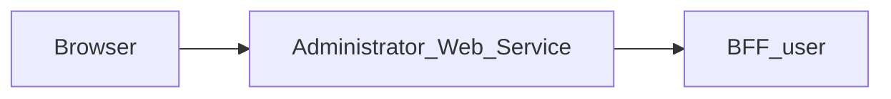

# Administrator_Web_Service — Technical documentation

## Active-module menu — MAIR-180 preparatory slice

Only the Sidebar item list excludes `emails` and `files`; existing URL resolution,
environment configuration, sessions and BFF calls are unchanged. Both desktop and
mobile render the same active list. Page-level regression coverage renders the
real Sidebar, checks item order/active item/admin visibility, opens the mobile
menu and follows Settings while closing the drawer. No library fork or new
package is introduced; the full MAIR-179/MAIR-180 AppShell dependency remains.

## Settings account destination — MAIR-180 slice

The server route `/profile/[[...path]]` replaces the local profile screens.
It temporarily redirects (307) to `SETTINGS_FRONT_URL`, resolved on each request;
no business profile is fetched by this module. Missing, invalid, credential-bearing
or legacy `profile` path destinations render an unavailable state with a link
back to the module. Old bookmark query parameters are not forwarded. Middleware
authentication is unchanged. No new contract, package, secret or environment
variable is introduced. This slice does not complete shared AppShell migration
(MAIR-179).

## Explicit frontend destinations (MAIR-177)

Frontend redirects use only explicitly configured HTTP(S) URLs without embedded
credentials. There is no implicit localhost destination. Set the existing
`LOGIN_FRONT_URL` (protected fronts) and `PROJECT_FRONT_URL` (Login default)
at runtime, including local development. A valid configured return destination
may still be used by Login when its default is absent. Invalid or missing
Login destinations produce an uncached HTTP 503 message in the middleware;
Login itself displays an unavailable state without a form when no destination
can be resolved. No BFF/API contract or deployment variable is added.


[Module overview](module.md) · [Français](../fr/technical.md) · [README](../../README.md)

## Architecture and request handling

Next.js 15.5.25, React 19 and TypeScript application using the App Router. The browser calls same-origin routes; the Next.js server forwards data to **BFF_user**.



`src/app/page.tsx` mounts `AdministrationModule` without repository-specific data callbacks. Detailed component behavior therefore depends on the version of `@mairie360/lib-components`. `src/lib/administration-api.ts` supplies a typed local client, but its presence does not prove that every shared-component screen uses it.

The generic proxy reads the versioned OpenAPI contract to allow paths and methods. It preserves query parameters, binary bodies, statuses and useful headers, filters transport headers, disables caching and does not automatically follow redirects. Its timeout is 15 seconds.

## Data and persistence

The following sources and limitations describe the associated BFF, which determines persistence for the displayed data.

Core supplies identity and session operations. The BFF SQL repositories also read users and roles and perform some password and group mutations. The first-sign-in flow uses PostgreSQL and Redis. Data access is therefore a mixture of HTTP and direct database operations.

Monitoring, backups, application logs and system policy described in administration requirements are not guaranteed by this contract. SQL access requires a compatible schema, including `group_members`; this name differs from `group_users` used in other contracts.

React state manages display and pending operations. This repository defines no business database of its own; save guarantees come from the BFF and its sources described above.

## Installation and local startup

Use Node.js 22 to reproduce the contract job and npm with the committed lockfile. Other job and Docker versions are detailed below.

Private `@mairie360/*` dependencies require GitHub Packages access. Set `NODE_AUTH_TOKEN` in the environment to a token allowed to read these packages, as configured in `.npmrc`. Do not commit its value.

```bash
npm ci
```

Create `.env.local` in the repository root. Example for BFF User running on the same machine:

```dotenv
BFF_ADMIN_BASE_URL=http://localhost:4000
```

Start BFF User, the only BFF called by this web service, then start the web service. Port `5010` below is an explicit local choice to avoid collisions; it is not a claim about ports in every Compose file.

```bash
npm run dev -- --port 5010
```

Open `http://localhost:5010`. To run the build with the Next.js script:

```bash
npm run build
npm run start -- --port 5010
```

## Configuration

On a missing or expired session, the middleware sends `redirect` to Login. It builds the destination from the runtime `ADMINISTRATION_FRONT_URL` plus the requested path and query, never from the internal ingress host. Without a valid public URL, Login uses its default Projects destination.

Values below are local examples or explicitly described behavior, not production credentials.

| Variable or precedence | Example / stated fallback | Purpose |
| --- | --- | --- |
| `BFF_ADMIN_BASE_URL` → `USER_BFF_URL` → `BFF_USER_API_URL` → `NEXT_PUBLIC_BFF_ADMIN_BASE_URL` | http://localhost:4000 | URL of BFF User, the front's only BFF, resolved by `configuredBffUrl` for both proxy and session adapters. Configure an HTTP(S) URL explicitly; missing or invalid configuration returns an uncached 503 without contacting an upstream. |
| `COOKIE_DOMAIN` | — | Cookie domain; keep it consistent with Login and BFF User. |
| `ADMINISTRATION_FRONT_URL` | — | Navigation destination; see the source file that reads it. Variables injected by `next.config.ts` or prefixed `NEXT_PUBLIC_` are public and consumed at build time. |
| `CALENDAR_FRONT_URL` | — | Navigation destination; see the source file that reads it. Variables injected by `next.config.ts` or prefixed `NEXT_PUBLIC_` are public and consumed at build time. |
| `ELEARNING_FRONT_URL` | — | Navigation destination; see the source file that reads it. Variables injected by `next.config.ts` or prefixed `NEXT_PUBLIC_` are public and consumed at build time. |
| `EMAIL_FRONT_URL` | — | Navigation destination; see the source file that reads it. Variables injected by `next.config.ts` or prefixed `NEXT_PUBLIC_` are public and consumed at build time. |
| `FILES_FRONT_URL` | — | Navigation destination; see the source file that reads it. Variables injected by `next.config.ts` or prefixed `NEXT_PUBLIC_` are public and consumed at build time. |
| `LOGIN_FRONT_URL` | — | Navigation destination; see the source file that reads it. Variables injected by `next.config.ts` or prefixed `NEXT_PUBLIC_` are public and consumed at build time. |
| `MESSAGE_FRONT_URL` | — | Navigation destination; see the source file that reads it. Variables injected by `next.config.ts` or prefixed `NEXT_PUBLIC_` are public and consumed at build time. |
| `PROJECT_FRONT_URL` | — | Navigation destination; see the source file that reads it. Variables injected by `next.config.ts` or prefixed `NEXT_PUBLIC_` are public and consumed at build time. |
| `SETTINGS_FRONT_URL` | — | Navigation destination; see the source file that reads it. Variables injected by `next.config.ts` or prefixed `NEXT_PUBLIC_` are public and consumed at build time. |

Inside a container, `localhost` refers to that container. Use the BFF service DNS name on the Docker network or a reachable host address. Compose files sometimes include other services and legacy settings; check effective URLs and ports before using them.

## Routes and data contract

Inventory extracted from `contracts/openapi.json`, rebuilt from the published `@mairie360/bff-user-openapi` package pinned in `package.json`. Replace brace parameters with real identifiers. Detailed types and required fields are defined in that contract. The package (orval output) only types success responses, shown as `2XX`, plus responses modelled per status such as `412`: errors, formats and response headers are not part of it.

These data paths are exposed at the same origin through the proxy; Next.js pages are separate. `/openapi.json` and `/swagger.json` are also forwarded. Open the `/docs` Swagger UI directly on the BFF.

| Method | Path | Declared body | Declared statuses |
| --- | --- | --- | --- |
| POST | `/auth/force_change_password` | application/json | 2XX |
| POST | `/auth/login` | application/json | 2XX, 412 |
| POST | `/auth/logout` | — | 2XX |
| POST | `/auth/register` | application/json | 2XX |
| GET | `/bff/admin/groups` | — | 2XX |
| POST | `/bff/admin/groups` | application/json | 2XX |
| GET | `/bff/admin/groups/{groupId}` | — | 2XX |
| PATCH | `/bff/admin/groups/{groupId}` | application/json | 2XX |
| DELETE | `/bff/admin/groups/{groupId}` | — | 2XX |
| GET | `/bff/admin/groups/{groupId}/users` | — | 2XX |
| POST | `/bff/admin/groups/{groupId}/users` | application/json | 2XX |
| DELETE | `/bff/admin/groups/{groupId}/users/{userId}` | — | 2XX |
| GET | `/bff/admin/roles` | — | 2XX |
| POST | `/bff/admin/roles` | application/json | 2XX |
| PUT | `/bff/admin/roles/{roleId}` | application/json | 2XX |
| PATCH | `/bff/admin/roles/{roleId}` | application/json | 2XX |
| DELETE | `/bff/admin/roles/{roleId}` | — | 2XX |
| GET | `/bff/admin/sessions` | — | 2XX |
| GET | `/bff/admin/sessions/history` | — | 2XX |
| POST | `/bff/admin/sessions/refresh` | application/json | 2XX |
| POST | `/bff/admin/sessions/revoke` | application/json | 2XX |
| GET | `/bff/admin/users` | — | 2XX |
| POST | `/bff/admin/users` | application/json | 2XX |
| PATCH | `/bff/admin/users/{userId}` | application/json | 2XX |
| DELETE | `/bff/admin/users/{userId}` | — | 2XX |
| PATCH | `/bff/admin/users/{userId}/password` | application/json | 2XX |
| POST | `/bff/admin/users/{userId}/roles` | application/json | 2XX |
| DELETE | `/bff/admin/users/{userId}/roles/{roleId}` | — | 2XX |
| GET | `/check_apis` | — | 2XX |
| GET | `/health` | — | 2XX |
| GET | `/me` | — | 2XX |
| GET | `/session/me` | — | 2XX |
| GET | `/user/{userId}/about` | — | 2XX |

### Pages and local adapters

| Page | Source |
| --- | --- |
| `/` | [src/app/page.tsx](../../src/app/page.tsx) |
| `/profile/[[...path]]` | [src/app/profile/[[...path]]/page.tsx](../../src/app/profile/%5B%5B...path%5D%5D/page.tsx) |

| Method | Local route | Source |
| --- | --- | --- |
| GET | `/api/user/me` | [src/app/api/user/me/route.ts](../../src/app/api/user/me/route.ts) |
| POST | `/api/auth/logout` | [src/app/api/auth/logout/route.ts](../../src/app/api/auth/logout/route.ts) |
| GET | `/api/auth/me` | [src/app/api/auth/me/route.ts](../../src/app/api/auth/me/route.ts) |
| GET | `/api/auth/session` | [src/app/api/auth/session/route.ts](../../src/app/api/auth/session/route.ts) |

## Session, permissions and errors

The `/api/auth/me`, `/api/auth/session` and `/api/user/me` adapters use BFF User for session access; `/api/auth/logout` forwards logout. They target the same BFF URL as the generic proxy. The proxy uses an explicit Bearer header or, when absent, the `accessToken` cookie. Business permissions remain those of the BFF and its sources.

The `src/lib/administration-api.ts` client types its data with the `@mairie360/bff-user-openapi/model` package models and rejects inputs outside the contract bounds before any call (search longer than 100 characters, password outside 8 to 255 characters, empty group name or longer than 64 characters, description longer than 2000 characters).

The generic proxy returns 400 for an invalid path, 404 for a path outside the contract, 405 for a disallowed method and 502 when the service is unreachable or times out. Upstream responses are preserved, including empty 204/205/304 bodies.

Every response carries `X-Frame-Options: DENY`, `X-Content-Type-Options: nosniff`, `Referrer-Policy`, `Permissions-Policy` and `Cross-Origin-Resource-Policy`, `Cross-Origin-Embedder-Policy` and `Cross-Origin-Opener-Policy` (`next.config.ts`), and `X-Powered-By` is disabled. For authenticated requests, [src/middleware.ts](../../src/middleware.ts) adds a `Content-Security-Policy` with a per-request nonce, which Next.js applies to its scripts. Pages are therefore rendered on demand (`dynamic = "force-dynamic"` in the layout). Stylesheets are limited to the origin and the nonce; only `style` attributes rendered by shared components are allowed through `style-src-attr 'unsafe-inline'`, and `next dev` also allows `'unsafe-eval'`. Any new external resource (image, font, API called from the browser) must be added to the policy in `src/lib/content-security-policy.ts`.

## Synchronization and verification

The only contract is BFF User’s, as **published** in `@mairie360/bff-user-openapi`, pinned to an exact `X.Y.Z` version (never a `0.0.0-dev`/`staging` pre-release, never a copy from a BFF checkout, which can be ahead of the release). Renovate bumps the version; after a new package version:

```bash
npm run contracts:sync
npm run contracts:check
npm test
npm run lint
npm run build
```

The package contains orval TypeScript, not `openapi.json`: [scripts/orval-contract.mjs](../../scripts/orval-contract.mjs) rebuilds the OpenAPI document from it and `contracts:sync` writes it to `contracts/openapi.json` (read by the proxy and the tests). `contracts:check` fails if the version is not exact, if the installed package differs from `package.json`, if a second `@mairie360/bff-*-openapi` package appears or if the snapshot is stale. `src/lib/administration-api.ts` imports its types from `@mairie360/bff-user-openapi/model`. `npm test` runs the Node tests and fails below 60% line, branch or function coverage of the `src/` modules loaded by the tests (`test:contracts` runs the same tests without coverage); React components (`.tsx`) are not measured.

The `tests/*.bff-mock.test.cjs` and `tests/network-contract.test.cjs` tests run the real front code against a fake BFF User served over local HTTP and driven by `contracts/openapi.json` ([tests/support/contract-mock-server.cjs](../../tests/support/contract-mock-server.cjs), same validator as the BFF tests). The `tests/support/front-harness.cjs` harness simulates the browser: a relative `fetch` goes through `src/middleware.ts` and then the matching `src/app` route handler, and a server-side `fetch` is only allowed towards the fake BFF. Every received request (path, method, parameters, query, JSON body) and every mocked success response is validated against the contract; error responses, which the package does not type, are declared out of contract. Any mismatch, unmocked call or network call to another host fails the test. `tests/network-contract.test.cjs` also checks the exact package version, that BFF User is the only BFF (only `bff-*-openapi` package, only BFF image of the Docker stacks, same URL for the proxy and the adapters), that `contracts/openapi.json` is the exact rebuild of the package, that every contract operation is relayed by the proxy, that paths and methods outside the contract never reach the BFF and that only `bff-client.ts`, `auth-session.ts` and `bff-proxy.ts` call `fetch`. Only `/openapi.json` and `/swagger.json` are relayed outside the contract. `tests/administration-api.bff-mock.test.cjs` fails if a `/bff/admin/*` contract operation is not exercised.

For documentation-only changes, check links, accuracy in both languages and `git diff --check`; do not regenerate contracts without changing the package version.

## CI/CD and Docker execution

The `contracts.yml` job uses Node.js 22, `actions/checkout@v7` and `actions/setup-node@v7`. It runs on pushes, pull requests and manual dispatch; it installs with `npm ci`, checks contracts and runs the associated tests.

`cicd.yml` calls `mairie360/CICD/.github/workflows/frontend-cicd.yml@v2.0.0`, with `cicd_version: v2.0.0` and `node_version: "23"`. Reusable steps and GitHub environments determine actual checks, publications and deployments.

The Dockerfile defaults to `NODE_VERSION=23.1.0` and the Next.js `standalone` build; the image command is `["node", "server.js"]`. Image ports and Compose mappings can differ from the local port suggested above.

Before running Docker, check service variables, build secrets and networks in the repository files. Green CI validates its jobs; it does not prove business-service availability in a remote environment.

## Troubleshooting

Associated BFF diagnostics: If sign-in works but administration fails, check `JWT_SECRET`, the stored role and SQL access. If first-sign-in password change fails, check Redis, the temporary token and PostgreSQL.

For a proxy error, compare the path and method with the inventory, then check the BFF URL and session. For a 401 after navigating between modules, check the `accessToken` cookie, its domain and BFF User. A 404 for a requirement described in `BACKEND.md` may refer to a feature that is only proposed.

## Repository reference

- [src/app/page.tsx](../../src/app/page.tsx)
- [src/lib/administration-api.ts](../../src/lib/administration-api.ts)
- [src/lib/auth-session.ts](../../src/lib/auth-session.ts)
- [src/middleware.ts](../../src/middleware.ts)
- [src/lib/bff-proxy.ts](../../src/lib/bff-proxy.ts)
- [src/app/[...path]/route.ts](../../src/app/%5B...path%5D/route.ts)
- [src/lib/user-bff-proxy.ts](../../src/lib/user-bff-proxy.ts)
- [contracts/openapi.json](../../contracts/openapi.json)
- [scripts/orval-contract.mjs](../../scripts/orval-contract.mjs)
- [scripts/contracts.mjs](../../scripts/contracts.mjs)
- [package.json](../../package.json)
- [.github/workflows/contracts.yml](../../.github/workflows/contracts.yml)
- [.github/workflows/cicd.yml](../../.github/workflows/cicd.yml)
- [Dockerfile](../../Dockerfile)
- [docker-compose.yml](../../docker-compose.yml)

Historical supplements: [BFF.md](../../BFF.md), [BACKEND.md](../../BACKEND.md). Proposed requirements must remain distinct from implemented behavior.
