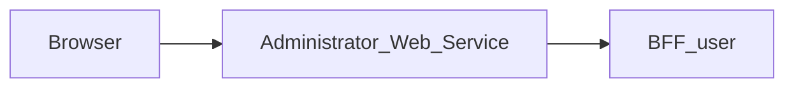

# Administrator_Web_Service — Technical documentation

## Console component boundaries — MAIR-406

`administration-console.tsx` retains global reads, request revisions and the
synchronous mutation guard. It imports `users-panel`, `roles-panel`,
`groups-panel` and `sessions-panel` directly from `components/administration`.
Their local state and callbacks are unchanged. `controls.tsx` shares fields,
panels, buttons, empty states and date formatting; `confirm-modal.tsx` keeps the
existing focus/busy handling. `types.ts` shares only the `RunAction` type.
No cyclic dependency, barrel export, new fetch, effect, lazy-loading boundary or
API/BFF change is introduced. Component-boundary tests and the real HTTP/HTML
refresh regression complement the existing request/confirmation suites.

## Opaque redirect recovery in the data client — MAIR-406

`requestBff` sets `redirect: 'manual'` after caller options. After fetch, the
caller signal is checked before response handling. `opaqueredirect` is recognized
before reading status, headers or body: the browser reopens its current document
once per `Location` (weak ownership), then rejects with
`BffNavigationRequiredError`. SSR rejects without accessing `window`; concurrent
reads cannot cause repeated navigation and no write is replayed. The unchanged
middleware owns Login and its validated return URL. Ordinary errors still throw
`BffRequestError`; a generic network failure is not evidence of expiration.
Six client regressions cover opaque concurrency, mutation, abort, ordinary
401/403/503, network failure and SSR. No routes, proxy, auth hook, contract,
security policy, dependency, API/BFF or deployment change.

## Profile-first page rendering — MAIR-406

`src/app/page.tsx` derives four explicit branches from the unchanged
`useAuthSession`: loading, error, Admin console, other-role denial. No extra
effect, cached permission state, role parser or network call is introduced.
Only the Admin branch mounts `AdministrationConsole`, so pending, failed and
non-admin profiles cannot initiate its five initial administration reads.
The error button reloads the document to retry the existing profile hook; no
mutation is replayed. The existing hook handles 401 logout before resolution.
Real-page/route/HTTP tests cover deferred resolution, four non-admin roles,
403/503 profile failures, retry, 401 and unchanged authorized console loading.
This is not signature, deployed authorization, revocation or stale-role
revalidation certification. API/BFF, middleware, proxy and User0.5.0 stay intact.

## Cookie forwarding without stored JWT injection — MAIR-406

`src/lib/bff-client.ts` builds headers from `RequestInit` and supplies missing
JSON defaults only. It no longer imports `getStoredAuthorizationHeader`; old
storage keys cannot supply an automatic bearer header or be migrated by a data
request. Explicit Authorization is preserved, while the unchanged frontend
proxy uses the cookie when no header is supplied. Cleanup helpers, middleware,
auth adapters, session management and the published User0.5.0 contract are
unchanged. Four regressions cover cookie precedence, legacy-key preservation,
zero storage accesses (including denied access) and storage without a cookie.
HTTP fixtures exercise real routes/proxy; they do not prove native storage,
deployed rights, signature validation or server-side revocation.

## Shared footer — MAIR-180

The unchanged CI audit exposed the transitive tooling dependency
`brace-expansion@1.1.18`. Its lock entry now resolves to the compatible patched
`1.1.21`, with registry-verified integrity, as documented in
[the upstream advisory](https://github.com/advisories/GHSA-qhr7-859c-m2p7).
No audit threshold, workflow or security policy is relaxed.

The package is pinned to published `@mairie360/lib-components@0.6.8` from
[the successful 0.6.8 publication](https://github.com/mairie360/lib-components/actions/runs/36836970818), including the sidebar-footer correction #388.
AppShell now places copyright in the dark sidebar, outside scrolling navigation.
The mobile drawer retains focus management. No content-footer band reduces the
main viewport; only supplied information is shown, with no invented version.
Contracts, APIs/BFFs and deployment approvals are unchanged. Consumer adoption
is tracked in [shared issue #387](https://github.com/mairie360/lib-components/issues/387).

## CI supply-chain policy — MAIR-230 frontend slice

Third-party checkout, Node setup and Renovate auto-approval actions use full
official commit SHAs. The shared frontend workflow remains at v3.1.1 and receives
only its declared CODECOV_TOKEN and N8N_WEBHOOK_SECRET references; no secret value
is stored or read. Existing permissions and Semgrep rules/verdicts are unchanged.

Both CI workflows use Node 24. Tests require npm >=11.10, which supports the
committed `min-release-age=7` policy, without package exclusions. This is a
seven-day window for **new dependency resolution**, not a scan or rewriting of
the existing lockfile used by `npm ci`. See the [npm config documentation](https://docs.npmjs.com/cli/v11/using-npm/config/#min-release-age).
Use the same Node/npm toolchain for local dependency updates and tests.
`tests/ci-policy.test.cjs` checks immutable action references, the explicit secret
map, release-age configuration and the npm version actually running the tests.

Docker runtime/build versions and their locked install remain unchanged; no new
runtime environment variable, secret, API/BFF contract or shared-CICD edit is
part of this slice. These CI checks do not certify a deployed environment.

## Shared AppShell — MAIR-180

`src/app/page.tsx` passes the current session, active module and validated
runtime destinations from `src/lib/navigation.ts` to the shared
`@mairie360/lib-components` AppShell. Invalid or credential-bearing URLs are
omitted; a Settings URL pointing back to `/profile` is also rejected. The
consumer change awaits publication of the updated library package.
The shell owns desktop/mobile navigation, Header and Footer; local Sidebar
items and the duplicate shell were removed. E-mails and Files remain archived and
absent from its default menu. Existing environment variables, session logic and
BFF calls are unchanged. The package version must match the seven other active
frontends after MAIR-179 publishes it.

## Settings account destination — MAIR-180 slice

No local `/profile` page remains. For authenticated legacy bookmarks, the
frontend middleware temporarily redirects (307) to `SETTINGS_FRONT_URL`,
resolved on each request; no profile is fetched by this module. Missing,
invalid, credential-bearing or looping destinations return an uncached 503
instead. Old bookmark query parameters are not forwarded. Authentication and
the BFF contract are unchanged.

## Explicit frontend destinations (MAIR-177)

Frontend redirects use only explicitly configured HTTP(S) URLs without embedded
credentials. There is no implicit localhost destination. Set the existing
`LOGIN_FRONT_URL` (protected fronts) and `PROJECT_FRONT_URL` (Login default)
at runtime, including local development. A valid configured return destination
may still be used by Login when its default is absent. Invalid or missing
Login destinations produce an uncached HTTP 503 message in the middleware;
Login itself displays an unavailable state without a form when no destination
can be resolved. No BFF/API contract or deployment variable is added.


[Module overview](module.md) · [Français](../fr/technical.md) · [README](../../README.md)

## Architecture and request handling

Next.js 15.5.25, React 19 and TypeScript application using the App Router. The browser calls same-origin routes; the Next.js server forwards data to **BFF_user**.


```mermaid
flowchart LR
  Browser --> Next["Administrator_Web_Service"]
  Next --> BFF["BFF_user"]
```

`src/app/page.tsx` mounts the BFF-backed local `AdministrationConsole` inside
the shared AppShell. `src/lib/administration-api.ts` supplies its typed client;
the library owns navigation and layout, not business data.

The generic proxy reads the versioned OpenAPI contract to allow paths and methods. It preserves query parameters, binary bodies, statuses and useful headers, filters transport headers, disables caching and does not automatically follow redirects. Its timeout is 15 seconds.

## Data and persistence

The following sources and limitations describe the associated BFF, which determines persistence for the displayed data.

Core supplies identity and session operations. The BFF SQL repositories also read users and roles and perform some password and group mutations. The first-sign-in flow uses PostgreSQL and Redis. Data access is therefore a mixture of HTTP and direct database operations.

Monitoring, backups, application logs and system policy described in administration requirements are not guaranteed by this contract. SQL access requires a compatible schema, including `group_members`; this name differs from `group_users` used in other contracts.

React state manages display and pending operations. This repository defines no business database of its own; save guarantees come from the BFF and its sources described above.

## Installation and local startup

Use Node.js 24 and npm >=11.10 to reproduce CI with the committed lockfile. Docker versions are unchanged and detailed below.

Private `@mairie360/*` dependencies require GitHub Packages access. Set `NODE_AUTH_TOKEN` in the environment to a token allowed to read these packages, as configured in `.npmrc`. Do not commit its value.

```bash
npm ci
```

Create `.env.local` in the repository root. Example for BFF User running on the same machine:

```dotenv
BFF_ADMIN_BASE_URL=http://localhost:4000
```

Start BFF User, the only BFF called by this web service, then start the web service. Port `5010` below is an explicit local choice to avoid collisions; it is not a claim about ports in every Compose file.

```bash
npm run dev -- --port 5010
```

Open `http://localhost:5010`. To run the build with the Next.js script:

```bash
npm run build
npm run start -- --port 5010
```

## Configuration

On a missing or expired session, the middleware sends `redirect` to Login. It builds the destination from the runtime `ADMINISTRATION_FRONT_URL` plus the requested path and query, never from the internal ingress host. Without a valid public URL, Login uses its default Projects destination.

Values below are local examples or explicitly described behavior, not production credentials.

| Variable or precedence | Example / stated fallback | Purpose |
| --- | --- | --- |
| `BFF_ADMIN_BASE_URL` → `USER_BFF_URL` → `BFF_USER_API_URL` → `NEXT_PUBLIC_BFF_ADMIN_BASE_URL` | http://localhost:4000 | URL of BFF User, the front's only BFF, resolved by `configuredBffUrl` for both proxy and session adapters. Configure an HTTP(S) URL explicitly; missing or invalid configuration returns an uncached 503 without contacting an upstream. |
| `COOKIE_DOMAIN` | — | Cookie domain; keep it consistent with Login and BFF User. |
| `ADMINISTRATION_FRONT_URL` | — | Navigation destination; see the source file that reads it. Variables injected by `next.config.ts` or prefixed `NEXT_PUBLIC_` are public and consumed at build time. |
| `CALENDAR_FRONT_URL` | — | Navigation destination; see the source file that reads it. Variables injected by `next.config.ts` or prefixed `NEXT_PUBLIC_` are public and consumed at build time. |
| `ELEARNING_FRONT_URL` | — | Navigation destination; see the source file that reads it. Variables injected by `next.config.ts` or prefixed `NEXT_PUBLIC_` are public and consumed at build time. |
| `EMAIL_FRONT_URL` | — | Navigation destination; see the source file that reads it. Variables injected by `next.config.ts` or prefixed `NEXT_PUBLIC_` are public and consumed at build time. |
| `FILES_FRONT_URL` | — | Navigation destination; see the source file that reads it. Variables injected by `next.config.ts` or prefixed `NEXT_PUBLIC_` are public and consumed at build time. |
| `LOGIN_FRONT_URL` | — | Navigation destination; see the source file that reads it. Variables injected by `next.config.ts` or prefixed `NEXT_PUBLIC_` are public and consumed at build time. |
| `MESSAGE_FRONT_URL` | — | Navigation destination; see the source file that reads it. Variables injected by `next.config.ts` or prefixed `NEXT_PUBLIC_` are public and consumed at build time. |
| `PROJECT_FRONT_URL` | — | Navigation destination; see the source file that reads it. Variables injected by `next.config.ts` or prefixed `NEXT_PUBLIC_` are public and consumed at build time. |
| `SETTINGS_FRONT_URL` | — | Navigation destination; see the source file that reads it. Variables injected by `next.config.ts` or prefixed `NEXT_PUBLIC_` are public and consumed at build time. |

Inside a container, `localhost` refers to that container. Use the BFF service DNS name on the Docker network or a reachable host address. Compose files sometimes include other services and legacy settings; check effective URLs and ports before using them.

## Routes and data contract

Inventory extracted from `contracts/openapi.json`, rebuilt from the published `@mairie360/bff-user-openapi` package pinned in `package.json`. Replace brace parameters with real identifiers. Detailed types and required fields are defined in that contract. The package (orval output) only types success responses, shown as `2XX`, plus responses modelled per status such as `412`: errors, formats and response headers are not part of it.

These data paths are exposed at the same origin through the proxy; Next.js pages are separate. `/openapi.json` and `/swagger.json` are also forwarded. Open the `/docs` Swagger UI directly on the BFF.

| Method | Path | Declared body | Declared statuses |
| --- | --- | --- | --- |
| POST | `/auth/force_change_password` | application/json | 2XX |
| POST | `/auth/login` | application/json | 2XX, 412 |
| POST | `/auth/logout` | — | 2XX |
| POST | `/auth/register` | application/json | 2XX |
| GET | `/bff/admin/groups` | — | 2XX |
| POST | `/bff/admin/groups` | application/json | 2XX |
| GET | `/bff/admin/groups/{groupId}` | — | 2XX |
| PATCH | `/bff/admin/groups/{groupId}` | application/json | 2XX |
| DELETE | `/bff/admin/groups/{groupId}` | — | 2XX |
| GET | `/bff/admin/groups/{groupId}/users` | — | 2XX |
| POST | `/bff/admin/groups/{groupId}/users` | application/json | 2XX |
| DELETE | `/bff/admin/groups/{groupId}/users/{userId}` | — | 2XX |
| GET | `/bff/admin/roles` | — | 2XX |
| POST | `/bff/admin/roles` | application/json | 2XX |
| PUT | `/bff/admin/roles/{roleId}` | application/json | 2XX |
| PATCH | `/bff/admin/roles/{roleId}` | application/json | 2XX |
| DELETE | `/bff/admin/roles/{roleId}` | — | 2XX |
| GET | `/bff/admin/sessions` | — | 2XX |
| GET | `/bff/admin/sessions/history` | — | 2XX |
| POST | `/bff/admin/sessions/refresh` | application/json | 2XX |
| POST | `/bff/admin/sessions/revoke` | application/json | 2XX |
| GET | `/bff/admin/users` | — | 2XX |
| POST | `/bff/admin/users` | application/json | 2XX |
| PATCH | `/bff/admin/users/{userId}` | application/json | 2XX |
| DELETE | `/bff/admin/users/{userId}` | — | 2XX |
| PATCH | `/bff/admin/users/{userId}/password` | application/json | 2XX |
| POST | `/bff/admin/users/{userId}/roles` | application/json | 2XX |
| DELETE | `/bff/admin/users/{userId}/roles/{roleId}` | — | 2XX |
| GET | `/check_apis` | — | 2XX |
| GET | `/health` | — | 2XX |
| GET | `/me` | — | 2XX |
| GET | `/session/me` | — | 2XX |
| GET | `/user/{userId}/about` | — | 2XX |

### Pages and local adapters

| Page | Source |
| --- | --- |
| `/` | [src/app/page.tsx](../../src/app/page.tsx) |

Legacy `/profile` requests are handled by [src/middleware.ts](../../src/middleware.ts),
not by a local page.

| Method | Local route | Source |
| --- | --- | --- |
| GET | `/api/user/me` | [src/app/api/user/me/route.ts](../../src/app/api/user/me/route.ts) |
| POST | `/api/auth/logout` | [src/app/api/auth/logout/route.ts](../../src/app/api/auth/logout/route.ts) |
| GET | `/api/auth/me` | [src/app/api/auth/me/route.ts](../../src/app/api/auth/me/route.ts) |
| GET | `/api/auth/session` | [src/app/api/auth/session/route.ts](../../src/app/api/auth/session/route.ts) |

## Session, permissions and errors

The `/api/auth/me`, `/api/auth/session` and `/api/user/me` adapters use BFF User for session access; `/api/auth/logout` forwards logout. They target the same BFF URL as the generic proxy. The proxy uses an explicit Bearer header or, when absent, the `accessToken` cookie. Business permissions remain those of the BFF and its sources.

The `src/lib/administration-api.ts` client types its data with the `@mairie360/bff-user-openapi/model` package models and rejects inputs outside the contract bounds before any call (search longer than 100 characters, password outside 8 to 255 characters, empty group name or longer than 64 characters, description longer than 2000 characters).

The generic proxy returns 400 for an invalid path, 404 for a path outside the contract, 405 for a disallowed method and 502 when the service is unreachable or times out. Upstream responses are preserved, including empty 204/205/304 bodies.

Every response carries `X-Frame-Options: DENY`, `X-Content-Type-Options: nosniff`, `Referrer-Policy`, `Permissions-Policy` and `Cross-Origin-Resource-Policy`, `Cross-Origin-Embedder-Policy` and `Cross-Origin-Opener-Policy` (`next.config.ts`), and `X-Powered-By` is disabled. For authenticated requests, [src/middleware.ts](../../src/middleware.ts) adds a `Content-Security-Policy` with a per-request nonce, which Next.js applies to its scripts. Pages are therefore rendered on demand (`dynamic = "force-dynamic"` in the layout). Stylesheets are limited to the origin and the nonce; only `style` attributes rendered by shared components are allowed through `style-src-attr 'unsafe-inline'`, and `next dev` also allows `'unsafe-eval'`. Any new external resource (image, font, API called from the browser) must be added to the policy in `src/lib/content-security-policy.ts`.

## Synchronization and verification

The only contract is BFF User’s, as **published** in `@mairie360/bff-user-openapi`, pinned to an exact `X.Y.Z` version (never a `0.0.0-dev`/`staging` pre-release, never a copy from a BFF checkout, which can be ahead of the release). Renovate bumps the version; after a new package version:

```bash
npm run contracts:sync
npm run contracts:check
npm test
npm run lint
npm run build
```

The package contains orval TypeScript, not `openapi.json`: [scripts/orval-contract.mjs](../../scripts/orval-contract.mjs) rebuilds the OpenAPI document from it and `contracts:sync` writes it to `contracts/openapi.json` (read by the proxy and the tests). `contracts:check` fails if the version is not exact, if the installed package differs from `package.json`, if a second `@mairie360/bff-*-openapi` package appears or if the snapshot is stale. `src/lib/administration-api.ts` imports its types from `@mairie360/bff-user-openapi/model`. `npm test` runs the Node tests and fails below 60% line, branch or function coverage of the `src/` modules loaded by the tests (`test:contracts` runs the same tests without coverage); React components (`.tsx`) are not measured.

The `tests/*.bff-mock.test.cjs` and `tests/network-contract.test.cjs` tests run the real front code against a fake BFF User served over local HTTP and driven by `contracts/openapi.json` ([tests/support/contract-mock-server.cjs](../../tests/support/contract-mock-server.cjs), same validator as the BFF tests). The `tests/support/front-harness.cjs` harness simulates the browser: a relative `fetch` goes through `src/middleware.ts` and then the matching `src/app` route handler, and a server-side `fetch` is only allowed towards the fake BFF. Every received request (path, method, parameters, query, JSON body) and every mocked success response is validated against the contract; error responses, which the package does not type, are declared out of contract. Any mismatch, unmocked call or network call to another host fails the test. `tests/network-contract.test.cjs` also checks the exact package version, that BFF User is the only BFF (only `bff-*-openapi` package, only BFF image of the Docker stacks, same URL for the proxy and the adapters), that `contracts/openapi.json` is the exact rebuild of the package, that every contract operation is relayed by the proxy, that paths and methods outside the contract never reach the BFF and that only `bff-client.ts`, `auth-session.ts` and `bff-proxy.ts` call `fetch`. Only `/openapi.json` and `/swagger.json` are relayed outside the contract. `tests/administration-api.bff-mock.test.cjs` fails if a `/bff/admin/*` contract operation is not exercised.

For documentation-only changes, check links, accuracy in both languages and `git diff --check`; do not regenerate contracts without changing the package version.

## CI/CD and Docker execution

The `contracts.yml` job uses Node.js 24 and commit-pinned checkout/setup-node actions (v7). It runs on pushes, pull requests and manual dispatch; it installs with `npm ci`, checks contracts and runs the associated tests.

`cicd.yml` calls `mairie360/CICD/.github/workflows/frontend-cicd.yml@v3.1.1`, with `cicd_version: v3.1.1` and `node_version: "24"`. Only CODECOV_TOKEN and N8N_WEBHOOK_SECRET are passed explicitly. Reusable steps and GitHub environments determine actual checks, publications and deployments.

The Dockerfile defaults to `NODE_VERSION=23.1.0` and the Next.js `standalone` build; the image command is `["node", "server.js"]`. Image ports and Compose mappings can differ from the local port suggested above.

Before running Docker, check service variables, build secrets and networks in the repository files. Green CI validates its jobs; it does not prove business-service availability in a remote environment.

## Troubleshooting

Associated BFF diagnostics: If sign-in works but administration fails, check `JWT_SECRET`, the stored role and SQL access. If first-sign-in password change fails, check Redis, the temporary token and PostgreSQL.

For a proxy error, compare the path and method with the inventory, then check the BFF URL and session. For a 401 after navigating between modules, check the `accessToken` cookie, its domain and BFF User. A 404 for a requirement described in `BACKEND.md` may refer to a feature that is only proposed.

## Repository reference

- [src/app/page.tsx](../../src/app/page.tsx)
- [src/lib/administration-api.ts](../../src/lib/administration-api.ts)
- [src/lib/auth-session.ts](../../src/lib/auth-session.ts)
- [src/middleware.ts](../../src/middleware.ts)
- [src/lib/bff-proxy.ts](../../src/lib/bff-proxy.ts)
- [src/app/[...path]/route.ts](../../src/app/%5B...path%5D/route.ts)
- [src/lib/user-bff-proxy.ts](../../src/lib/user-bff-proxy.ts)
- [contracts/openapi.json](../../contracts/openapi.json)
- [scripts/orval-contract.mjs](../../scripts/orval-contract.mjs)
- [scripts/contracts.mjs](../../scripts/contracts.mjs)
- [package.json](../../package.json)
- [.github/workflows/contracts.yml](../../.github/workflows/contracts.yml)
- [.github/workflows/cicd.yml](../../.github/workflows/cicd.yml)
- [Dockerfile](../../Dockerfile)
- [docker-compose.yml](../../docker-compose.yml)

Historical supplements: [BFF.md](../../BFF.md), [BACKEND.md](../../BACKEND.md). Proposed requirements must remain distinct from implemented behavior.
