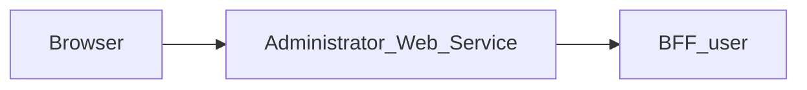

# Administrator_Web_Service — Documentation technique

## Destinations frontend explicites (MAIR-177)

Les redirections utilisent uniquement des URL HTTP(S) configurées, sans
identifiants intégrés. Aucun repli implicite vers localhost. Renseigner à
l’exécution les variables existantes `LOGIN_FRONT_URL` (fronts protégés) et
`PROJECT_FRONT_URL` (destination par défaut de Login), même en local. Login
accepte toujours un retour vers un front autorisé si sa destination par défaut
manque. Sans destination Login valide, le middleware répond 503 sans cache ;
Login affiche un état indisponible sans formulaire si aucune destination ne
peut être résolue. Aucun contrat API/BFF ni variable de déploiement ajouté.


[Présentation du module](module.md) · [English](../en/technical.md) · [README](../../README.md)

## Architecture et traitement des requêtes

Application Next.js 15.5.25, React 19 et TypeScript avec App Router. Le navigateur appelle les routes de la même origine; le serveur Next.js relaie les données vers **BFF_user**.



`src/app/page.tsx` monte `AdministrationModule` sans lui passer de callbacks de données spécifiques. Le comportement détaillé du composant dépend donc de la version de `@mairie360/lib-components`. `src/lib/administration-api.ts` fournit un client local typé, mais sa présence ne prouve pas que chaque écran du composant partagé l’utilise.

Le proxy générique lit le contrat OpenAPI versionné pour autoriser chemins et méthodes. Il conserve paramètres de requête, corps binaire, statuts et en-têtes utiles, filtre les en-têtes de transport, désactive le cache et n’effectue pas de suivi automatique des redirections. Son délai est de 15 secondes.

## Données et persistance

Les sources et limites suivantes concernent le BFF associé, dont dépend la sauvegarde des données affichées.

Core fournit les opérations d’identité et de session. Les dépôts SQL du BFF lisent aussi les utilisateurs et rôles, et réalisent certaines mutations de mots de passe et de groupes. Le parcours de première connexion utilise PostgreSQL et Redis. Les données ne sont donc pas toutes accessibles exclusivement par HTTP.

Les fonctions de supervision, sauvegarde, journaux applicatifs et politique système décrites dans les besoins d’administration ne sont pas garanties par ce contrat. Les accès SQL exigent un schéma compatible, notamment `group_members`; ne pas confondre ce nom avec `group_users` utilisé dans d’autres contrats.

L’état React gère l’affichage et les opérations en cours. Ce dépôt ne définit pas de base métier propre; les garanties de sauvegarde sont celles du BFF et de ses sources décrites ci-dessus.

## Installation et lancement local

Utiliser Node.js 22 pour reproduire le job de contrats et npm avec le fichier de verrouillage versionné. Les versions des autres jobs et de Docker sont précisées plus bas.

Les dépendances privées `@mairie360/*` nécessitent un accès GitHub Packages. Configurer `NODE_AUTH_TOKEN` dans l’environnement avec un jeton autorisé à lire ces packages, conformément à `.npmrc`. Ne pas enregistrer la valeur dans Git.

```bash
npm ci
```

Créer `.env.local` à la racine. Exemple pour BFF User exécuté sur la même machine:

```dotenv
BFF_ADMIN_BASE_URL=http://localhost:4000
```

Démarrer BFF User, seul BFF appelé par ce web service, puis lancer le web service. Le port `5010` ci-dessous est un choix local explicite pour éviter les collisions; ce n’est pas une affirmation sur les ports de tous les fichiers Compose.

```bash
npm run dev -- --port 5010
```

Ouvrir `http://localhost:5010`. Pour exécuter le build avec le script Next.js:

```bash
npm run build
npm run start -- --port 5010
```

## Configuration

Si la session manque ou a expiré, le middleware transmet `redirect` à Login. Il construit la destination avec `ADMINISTRATION_FRONT_URL` lu à l’exécution, puis le chemin et la query demandés, jamais avec l’hôte interne de l’ingress. Sans URL publique valide, Login utilise sa destination Projets par défaut.

Les valeurs ci-dessous sont des exemples locaux ou des comportements explicitement indiqués, pas des identifiants de production.

| Variable ou priorité | Exemple / repli indiqué | Rôle |
| --- | --- | --- |
| `BFF_ADMIN_BASE_URL` → `USER_BFF_URL` → `BFF_USER_API_URL` → `NEXT_PUBLIC_BFF_ADMIN_BASE_URL` | http://localhost:4000 | URL de BFF User, seul BFF du front, résolue par `configuredBffUrl` pour le proxy comme pour les adaptateurs de session (priorité de gauche à droite); l’URL indiquée est le repli local. |
| `COOKIE_DOMAIN` | — | Domaine des cookies; vérifier sa cohérence avec Login et BFF User. |
| `ADMINISTRATION_FRONT_URL` | — | Destination de navigation; voir le fichier source qui la lit. Les variables injectées par `next.config.ts` ou préfixées `NEXT_PUBLIC_` sont publiques et prises en compte lors du build. |
| `CALENDAR_FRONT_URL` | — | Destination de navigation; voir le fichier source qui la lit. Les variables injectées par `next.config.ts` ou préfixées `NEXT_PUBLIC_` sont publiques et prises en compte lors du build. |
| `ELEARNING_FRONT_URL` | — | Destination de navigation; voir le fichier source qui la lit. Les variables injectées par `next.config.ts` ou préfixées `NEXT_PUBLIC_` sont publiques et prises en compte lors du build. |
| `EMAIL_FRONT_URL` | — | Destination de navigation; voir le fichier source qui la lit. Les variables injectées par `next.config.ts` ou préfixées `NEXT_PUBLIC_` sont publiques et prises en compte lors du build. |
| `FILES_FRONT_URL` | — | Destination de navigation; voir le fichier source qui la lit. Les variables injectées par `next.config.ts` ou préfixées `NEXT_PUBLIC_` sont publiques et prises en compte lors du build. |
| `LOGIN_FRONT_URL` | — | Destination de navigation; voir le fichier source qui la lit. Les variables injectées par `next.config.ts` ou préfixées `NEXT_PUBLIC_` sont publiques et prises en compte lors du build. |
| `MESSAGE_FRONT_URL` | — | Destination de navigation; voir le fichier source qui la lit. Les variables injectées par `next.config.ts` ou préfixées `NEXT_PUBLIC_` sont publiques et prises en compte lors du build. |
| `PROJECT_FRONT_URL` | — | Destination de navigation; voir le fichier source qui la lit. Les variables injectées par `next.config.ts` ou préfixées `NEXT_PUBLIC_` sont publiques et prises en compte lors du build. |
| `SETTINGS_FRONT_URL` | — | Destination de navigation; voir le fichier source qui la lit. Les variables injectées par `next.config.ts` ou préfixées `NEXT_PUBLIC_` sont publiques et prises en compte lors du build. |

Dans un conteneur, `localhost` désigne le conteneur lui-même. Utiliser le nom DNS du service BFF sur le réseau Docker, ou une adresse d’hôte accessible. Les fichiers Compose incluent parfois d’autres services et des paramètres hérités; vérifier les URL et ports effectifs avant de les employer.

## Routes et contrat de données

Inventaire extrait de `contracts/openapi.json`, reconstruit depuis le paquet publié `@mairie360/bff-user-openapi` épinglé dans `package.json`. Les paramètres entre accolades sont remplacés par des identifiants réels. Les types détaillés et champs requis sont définis dans ce contrat. Le paquet (sortie orval) ne type que les réponses de succès, notées `2XX`, et les réponses modélisées par statut comme `412` : erreurs, formats et en-têtes de réponse n’en font pas partie.

Ces chemins de données sont exposés à la même origine par le proxy; les pages Next.js sont distinctes. `/openapi.json` et `/swagger.json` sont également relayés. L’interface Swagger `/docs` se consulte directement sur le BFF.

| Méthode | Chemin | Corps déclaré | Statuts déclarés |
| --- | --- | --- | --- |
| POST | `/auth/force_change_password` | application/json | 2XX |
| POST | `/auth/login` | application/json | 2XX, 412 |
| POST | `/auth/logout` | — | 2XX |
| POST | `/auth/register` | application/json | 2XX |
| GET | `/bff/admin/groups` | — | 2XX |
| POST | `/bff/admin/groups` | application/json | 2XX |
| GET | `/bff/admin/groups/{groupId}` | — | 2XX |
| PATCH | `/bff/admin/groups/{groupId}` | application/json | 2XX |
| DELETE | `/bff/admin/groups/{groupId}` | — | 2XX |
| GET | `/bff/admin/groups/{groupId}/users` | — | 2XX |
| POST | `/bff/admin/groups/{groupId}/users` | application/json | 2XX |
| DELETE | `/bff/admin/groups/{groupId}/users/{userId}` | — | 2XX |
| GET | `/bff/admin/roles` | — | 2XX |
| POST | `/bff/admin/roles` | application/json | 2XX |
| PUT | `/bff/admin/roles/{roleId}` | application/json | 2XX |
| PATCH | `/bff/admin/roles/{roleId}` | application/json | 2XX |
| DELETE | `/bff/admin/roles/{roleId}` | — | 2XX |
| GET | `/bff/admin/sessions` | — | 2XX |
| GET | `/bff/admin/sessions/history` | — | 2XX |
| POST | `/bff/admin/sessions/refresh` | application/json | 2XX |
| POST | `/bff/admin/sessions/revoke` | application/json | 2XX |
| GET | `/bff/admin/users` | — | 2XX |
| POST | `/bff/admin/users` | application/json | 2XX |
| PATCH | `/bff/admin/users/{userId}` | application/json | 2XX |
| DELETE | `/bff/admin/users/{userId}` | — | 2XX |
| PATCH | `/bff/admin/users/{userId}/password` | application/json | 2XX |
| POST | `/bff/admin/users/{userId}/roles` | application/json | 2XX |
| DELETE | `/bff/admin/users/{userId}/roles/{roleId}` | — | 2XX |
| GET | `/check_apis` | — | 2XX |
| GET | `/health` | — | 2XX |
| GET | `/me` | — | 2XX |
| GET | `/session/me` | — | 2XX |
| GET | `/user/{userId}/about` | — | 2XX |

### Pages et adaptateurs locaux

| Page | Source |
| --- | --- |
| `/` | [src/app/page.tsx](../../src/app/page.tsx) |
| `/profile` | [src/app/profile/page.tsx](../../src/app/profile/page.tsx) |

| Méthode | Route locale | Source |
| --- | --- | --- |
| GET | `/api/user/me` | [src/app/api/user/me/route.ts](../../src/app/api/user/me/route.ts) |
| POST | `/api/auth/logout` | [src/app/api/auth/logout/route.ts](../../src/app/api/auth/logout/route.ts) |
| GET | `/api/auth/me` | [src/app/api/auth/me/route.ts](../../src/app/api/auth/me/route.ts) |
| GET | `/api/auth/session` | [src/app/api/auth/session/route.ts](../../src/app/api/auth/session/route.ts) |

## Session, permissions et erreurs

Les adaptateurs `/api/auth/me`, `/api/auth/session` et `/api/user/me` utilisent BFF User pour la session; `/api/auth/logout` relaie la déconnexion. Ils visent la même URL de BFF que le proxy générique. Le proxy utilise le Bearer explicite ou, en son absence, le cookie `accessToken`. Les permissions métier restent celles du BFF et de ses sources.

Le client `src/lib/administration-api.ts` type ses données avec les modèles du paquet `@mairie360/bff-user-openapi/model` et rejette avant tout appel les saisies hors des bornes du contrat (recherche de plus de 100 caractères, mot de passe hors 8 à 255 caractères, nom de groupe vide ou de plus de 64 caractères, description de plus de 2000 caractères).

Le proxy générique répond 400 pour un chemin invalide, 404 pour un chemin hors contrat, 405 pour une méthode interdite et 502 si le service est injoignable ou dépasse le délai. Les réponses amont sont conservées, y compris les corps vides 204/205/304.

Toutes les réponses portent `X-Frame-Options: DENY`, `X-Content-Type-Options: nosniff`, `Referrer-Policy`, `Permissions-Policy` et `Cross-Origin-Resource-Policy`, `Cross-Origin-Embedder-Policy` et `Cross-Origin-Opener-Policy` (`next.config.ts`), et `X-Powered-By` est désactivé. Pour les requêtes authentifiées, [src/middleware.ts](../../src/middleware.ts) ajoute une `Content-Security-Policy` avec un nonce propre à chaque requête, que Next.js applique à ses scripts. Les pages sont donc rendues à la demande (`dynamic = "force-dynamic"` dans le layout). Les feuilles de style sont limitées à l'origine et au nonce ; seuls les attributs `style` rendus par les composants partagés passent par `style-src-attr 'unsafe-inline'`, et `next dev` autorise aussi `'unsafe-eval'`. Toute nouvelle ressource externe (image, police, API appelée depuis le navigateur) doit être ajoutée à la politique dans `src/lib/content-security-policy.ts`.

## Synchronisation et vérifications

Le seul contrat est celui de BFF User **publié** dans `@mairie360/bff-user-openapi`, épinglé à une version exacte `X.Y.Z` (jamais une pré-version `0.0.0-dev`/`staging`, jamais une copie d’un checkout du BFF, qui peut être en avance sur la release). Renovate monte la version; après une nouvelle version du paquet :

```bash
npm run contracts:sync
npm run contracts:check
npm test
npm run lint
npm run build
```

Le paquet contient du TypeScript orval, pas de `openapi.json` : [scripts/orval-contract.mjs](../../scripts/orval-contract.mjs) en reconstruit le document OpenAPI et `contracts:sync` l’écrit dans `contracts/openapi.json` (lu par le proxy et les tests). `contracts:check` échoue si la version n’est pas exacte, si le paquet installé diffère de `package.json`, si un second paquet `@mairie360/bff-*-openapi` apparaît ou si la copie est périmée. `src/lib/administration-api.ts` importe ses types depuis `@mairie360/bff-user-openapi/model`. `npm test` exécute les tests Node et échoue sous 60 % de couverture des lignes, branches ou fonctions des modules de `src/` chargés par les tests (`test:contracts` lance les mêmes tests sans couverture); les composants React (`.tsx`) ne sont pas mesurés.

Les tests `tests/*.bff-mock.test.cjs` et `tests/network-contract.test.cjs` exécutent le vrai code du front contre un faux BFF User servi en HTTP local et piloté par `contracts/openapi.json` ([tests/support/contract-mock-server.cjs](../../tests/support/contract-mock-server.cjs), même validateur que les tests des BFFs). Le harnais `tests/support/front-harness.cjs` simule le navigateur : un `fetch` relatif passe par `src/middleware.ts` puis par le route handler de `src/app` correspondant, et un `fetch` serveur n'est autorisé que vers le faux BFF. Chaque requête reçue (chemin, méthode, paramètres, query, corps JSON) et chaque réponse de succès simulée est validée contre le contrat; les réponses d’erreur, que le paquet ne type pas, sont déclarées hors contrat. Tout écart, appel non mocké ou appel réseau vers un autre hôte fait échouer le test. `tests/network-contract.test.cjs` vérifie aussi la version exacte du paquet, que BFF User est le seul BFF (seul paquet `bff-*-openapi`, seule image BFF des stacks Docker, même URL pour le proxy et les adaptateurs), que `contracts/openapi.json` est la reconstruction exacte du paquet, que chaque opération du contrat est relayée par le proxy, que les chemins et méthodes hors contrat n'atteignent jamais le BFF et que seuls `bff-client.ts`, `auth-session.ts` et `bff-proxy.ts` appellent `fetch`. Seuls `/openapi.json` et `/swagger.json` sont relayés hors contrat. `tests/administration-api.bff-mock.test.cjs` échoue si une opération `/bff/admin/*` du contrat n’est pas exercée.

Pour une modification uniquement documentaire, vérifier les liens, l’exactitude des deux langues et `git diff --check`; ne pas régénérer les contrats sans changer la version du paquet.

## CI/CD et exécution Docker

Le job `contracts.yml` utilise Node.js 22, `actions/checkout@v7` et `actions/setup-node@v7`. Il s’exécute sur push, pull request et lancement manuel; il installe avec `npm ci`, contrôle les contrats et lance les tests dédiés.

`cicd.yml` appelle `mairie360/CICD/.github/workflows/frontend-cicd.yml@v2.0.0`, avec `cicd_version: v2.0.0` et `node_version: "23"`. Les étapes réutilisables et les environnements GitHub déterminent les contrôles, publications et déploiements effectifs.

Le Dockerfile utilise par défaut `NODE_VERSION=23.1.0` et le build Next.js `standalone`; la commande de l’image est `["node", "server.js"]`. Le port de l’image et les mappings Compose peuvent différer du port local proposé plus haut.

Avant un lancement Docker, vérifier les variables de service, les secrets de build et les réseaux dans les fichiers du dépôt. Une CI verte valide ses jobs; elle ne prouve pas la disponibilité des services métier dans un environnement distant.

## Diagnostic

Diagnostic du BFF associé: Si la connexion fonctionne mais que l’administration échoue, vérifier la configuration `JWT_SECRET`, le rôle enregistré et l’accès SQL. Si le changement de première connexion échoue, vérifier Redis, le jeton temporaire et PostgreSQL.

En cas d’erreur de proxy, comparer la route et la méthode à l’inventaire, vérifier l’URL du BFF puis la session. Pour un 401 après navigation entre modules, vérifier le cookie `accessToken`, son domaine et le service BFF User. Un 404 sur un besoin décrit dans `BACKEND.md` peut correspondre à une fonctionnalité seulement proposée.

## Repères dans le dépôt

- [src/app/page.tsx](../../src/app/page.tsx)
- [src/lib/administration-api.ts](../../src/lib/administration-api.ts)
- [src/lib/auth-session.ts](../../src/lib/auth-session.ts)
- [src/middleware.ts](../../src/middleware.ts)
- [src/lib/bff-proxy.ts](../../src/lib/bff-proxy.ts)
- [src/app/[...path]/route.ts](../../src/app/%5B...path%5D/route.ts)
- [src/lib/user-bff-proxy.ts](../../src/lib/user-bff-proxy.ts)
- [contracts/openapi.json](../../contracts/openapi.json)
- [scripts/orval-contract.mjs](../../scripts/orval-contract.mjs)
- [scripts/contracts.mjs](../../scripts/contracts.mjs)
- [package.json](../../package.json)
- [.github/workflows/contracts.yml](../../.github/workflows/contracts.yml)
- [.github/workflows/cicd.yml](../../.github/workflows/cicd.yml)
- [Dockerfile](../../Dockerfile)
- [docker-compose.yml](../../docker-compose.yml)

Compléments historiques: [BFF.md](../../BFF.md), [BACKEND.md](../../BACKEND.md). Les besoins proposés doivent rester distincts du comportement effectivement implémenté.
